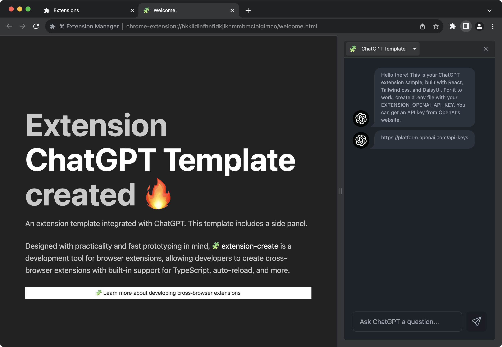

`extension-create` comes with built-in support for environment variables via `.env` file (and alikes).

> [!warning]
> This feature is not stable yet. You can track its development [here](https://github.com/cezaraugusto/extension-create/issues/40).

Take for example, our ChatGPT [[Template]].



See that it expects the `EXTENSION_OPENAI_API_KEY` environment variable? Create an `.env` file at the project root so extension-create can parse its contents at runtime.

<!--
print of the message saying the env file was loaded
https://github.com/cezaraugusto/extension-create/issues/41
-->

The following file names are supported:

* `.env`
* `.env.local`
* `.env.defaults`
* `.env.example`

## How To Use

<!-- this needs a demo -->

1. Create a new file using one of the supported file names at the same folder level as your `manifest.json` file.  
2. In your extension code, add the Node.js pattern of `process.env.YOUR_VARIABLE_NAME`. 

> TIP: Environment variables are not supported in the `manifest.json` file.

See the sample below:

```js
// service_worker.js
const helloWorld = process.env.HELLO_WORLD
console.log(helloWorld)
```

```.env
# .env
HELLO_WORLD=Hello, world!

```

Will output the following:

```diff
// service_worker.js
- const helloWorld = process.env.HELLO_WORLD
+ const helloWorld = "Hello, world!"
console.log(helloWorld)
```

<!--
## Environment Variables Available By Default 

Your extension have access to some default environment variables from extension-create.

* `EXTENSION_MODE` - The current mode extension-create is running. e.g. `"development"`
* `EXTENSION_BROWSER` - The name of the current browser being run, e.g. `"edge"`

## Environment Variables Based on Current Environment Mode

## Environment Variables Based on Current Browser Vendor
-->

---

**🧩 extension-create** • create cross-browser extensions with no build configuration.
