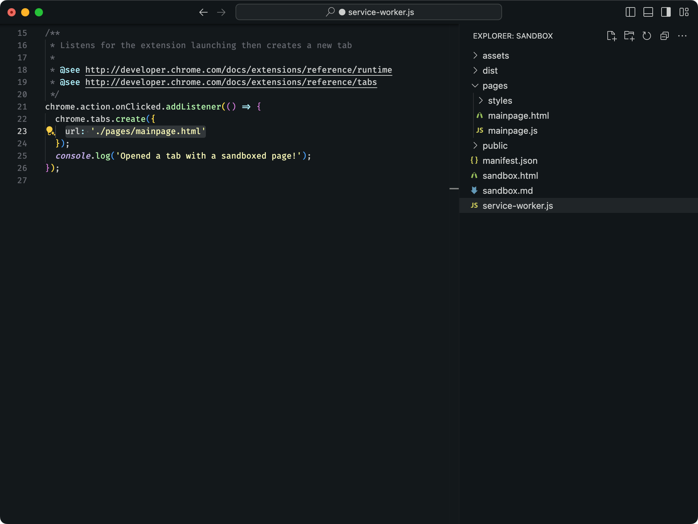
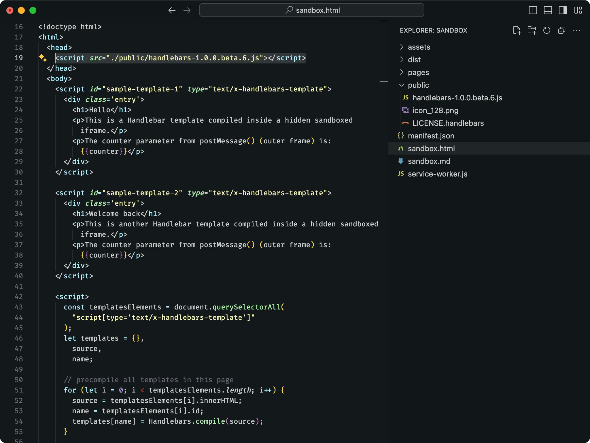

During development, sometimes we need a standalone script or page that adds extra functionality to an extension. It could be an iframe in a sandboxed page, or a script to be used as a content_script via `chrome.scripting.executeScript`. Given these features can be a core part of your extension development, they need the same support as any other file handled by the manifest file, like support for TypeScript, pre-processors and all other features provided by Extension.

This is the use case of the special folders.

Special folders are folders that allows you to work with files outside the scope of the manifest file. Since `Extension` uses the manifest to generate the assets, files outside its scope are not bundled by default -- unless they are in a special folder.

| Folder Name | Description |
|-------------|-------------|
| `pages/`    | Allows adding complementary HTML pages to the compilation process, handling its resources as any other HTML file from the manifest. |
| `scripts/`  | Allows adding script files to the compilation process that are not present in the manifest file or HTML pages.                      |
| `public/`   | Allows adding static assets to the output directory without bundling. These files are not processed by Extension.            |

## Handling HTML Pages

To work with complementary HTML files (such as internal page links or iframes), add the file into a `pages/` folder.

**Example:** 
An iframe as a sandboxed frame. [See the sandbox sample from Chrome Samples repository](https://github.com/GoogleChrome/chrome-extensions-samples/tree/main/api-samples/sandbox/sandbox). The iframe is likely to be edited several times during development, so adding it inside a `pages/` folder guarantees support for hot page reloads and full integration with JavaScript/CSS pre/post-processors.

## Handling Script Files

For scripts without the need of HTML files, add the file into a `scripts/` folder. Any JavaScript-like file in this folder is a valid entry point.

**Example:** 
* Scripts injected via <code>chrome.scripting.executeScript</code>. [See the scripting sample from Chrome Samples repository.](https://github.com/GoogleChrome/chrome-extensions-samples/tree/main/api-samples/scripting) where the API is called to request a script not defined in the `manifest.json` file. Adding the script to a `scripts/` folder guarantees support for hot page reloads and full integration with JavaScript/CSS pre/post-processors.

## Handling Static Assets

For files that you don't want Extension to parse, or if you want a predictable output path, add your files to the `public/` folder, like `<your-project>/public/icon/subfolder/icon.png`. Any file added to this folder will be copied to the output path as-is and reloaded automatically when changed. 

See thee example below using the previous [sandbox sample from Chrome Samples repository](https://github.com/GoogleChrome/chrome-extensions-samples/tree/main/api-samples/sandbox/sandbox). `handlebars.js` is an external lib that we don't want to parse, so we add it to the `/public` path, and `Extension` will output the file as-is, skipping the compilation process.

## Next Steps

- Check the diffent types of [[Templates]] to bootstrap your next extension.
- Learn more about how `Extension` handles [[Manifest Compatibility Checker]].

---

**🧩 Extension** • create cross-browser extensions with no build configuration.
