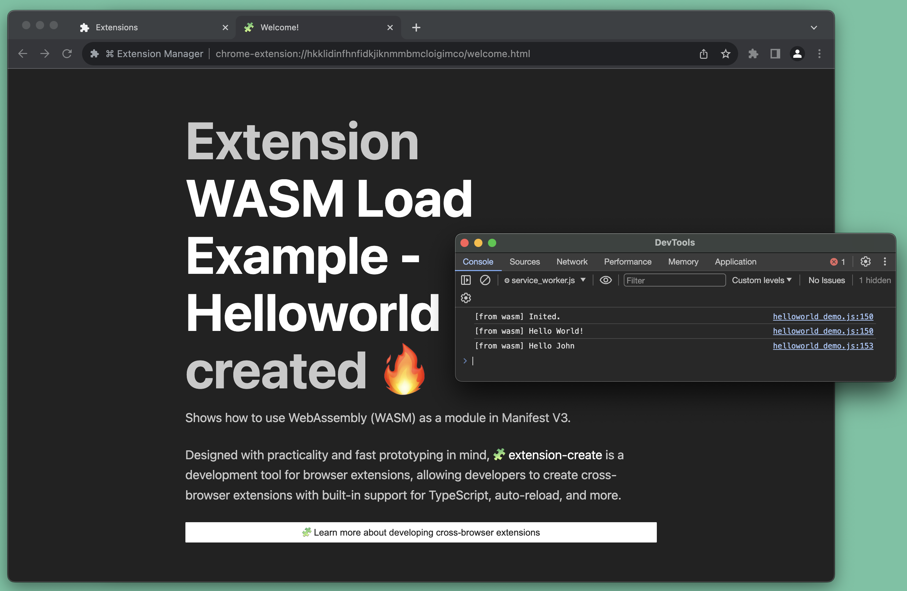

From the [WebAssembly website](https://webassembly.org/):

> WebAssembly (abbreviated Wasm) is a binary instruction format for a stack-based virtual machine. Wasm is designed as a portable compilation target for programming languages, enabling deployment on the web for client and server applications.

With WebAssembly, developers can write parts of the extension in languages like C, C++, Rust, or others. The compiled modules can be imported and executed from the extension's JavaScript context, improving the performance of the extension for tasks that are resource-intensive, like processing large amounts of data or compressing/converting audio and video files.

`extension-create` offers built-in WebAssembly (WASM) support. You can play around with WASM in `extension-create` by running the Chrome Sample [`cookbook.wasm-helloworld-print`](https://github.com/GoogleChrome/chrome-extensions-samples/tree/main/functional-samples/cookbook.wasm-helloworld-print):

```sh
npx extension dev https://github.com/GoogleChrome/chrome-extensions-samples/tree/main/functional-samples/cookbook.wasm-helloworld-print
```


* Learn how `extension-create` works with extensions using [[Modern JavaScript]].

---

**🧩 extension-create** • create cross-browser extensions with no build configuration.
