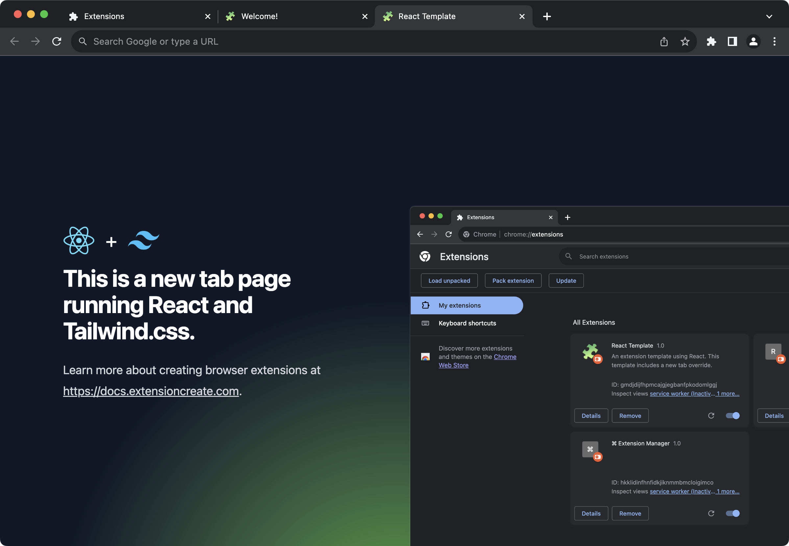
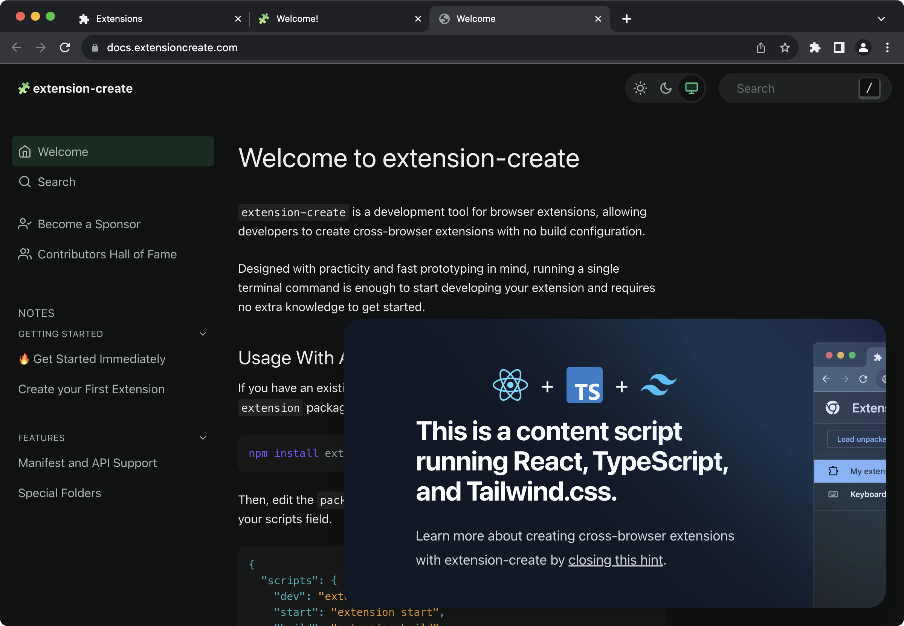

<!-- 
AUTHOR HINT: Browser runtimes are the "--template" flag capabilities
-->

You can create new extensions based on existing templates. Just pass a `--template` flag and use one of the options below.

```sh
npx extension create my-extension --template=<template>
```

|Template Flag|Description|Demo|
|-|-|-|
| `--template=new` | Includes a new tab page override (default). | [Demo](#template-new) |
| `--template=init`| Includes a single manifest.json file. | [Demo](#template-init) |
| `--template=content` | Includes a content_script. | [Demo](#template-content) |
| `--template=react` | Includes a new tab override using [React](https://react.dev) and [Tailwind.css](https://tailwindcss.com/). | [Demo](#template-react) |
| `--template=typescript` | Includes a new tab override using [TypeScript](https://www.typescriptlang.org/). | [Demo](#template-typescript) |
| `--template=react-typescript` | Includes a content_script using [React](https://react.dev) and [Tailwind.css](https://tailwindcss.com/). | [Demo](#template-react-typescript) |
| `--template=chatgpt` | Includes a sidebar_panel using [React](https://react.dev), [Tailwind.css](https://tailwindcss.com/), [DaisyUI](https://daisyui.com), and a ChatGPT integration. | [Demo](#template-chatgpt) |

# --template=new

The default template includes a new tab page override, built with HTML, CSS, and JavaScript.


## Usage

```sh
npx extension create <your-extension-name>
```

# --template=init

For fast prototypes, includes just a single manifest.json file.


```sh
npx extension create <your-extension-name> --template=init
```

# --template=content

Similar to the default template, except for the HTML part, which we inherit from the current tab. Uses JavaScript and CSS as a content_script.


```sh
npx extension create <your-extension-name> --template=content
```

# --template=react

Great for new projects using JSX without [TypeScript](https://www.typescriptlang.org/). Includes a new tab override using [React](https://react.dev) and [Tailwind.css](https://tailwindcss.com/).



```sh
npx extension create <your-extension-name> --template=react
```

# --template=typescript

Similar to the default template, includes a new tab page override, built with HTML, CSS, and [TypeScript](https://www.typescriptlang.org/).


```sh
npx extension create <your-extension-name> --template=typescript
```

# --template=react-typescript

Great for bootstrapping extensions with a rich UI experience. Includes a content_script using [React](https://react.dev), [TypeScript](https://www.typescriptlang.org/) and [Tailwind.css](https://tailwindcss.com/).



```sh
npx extension create <your-extension-name> --template=react-typescript
```

# --template=chatgpt

The most complete template available. Fully integrated with the ChatGPT API. Includes a `sidebar_panel` using [React](https://react.dev), [Tailwind.css](https://tailwindcss.com/), and the [official OpenAI Node API library](https://www.npmjs.com/package/openai). 


```sh
npx extension create <your-extension-name> --template=chatgpt
```

## Next Steps

* Understand [[Browser Runners]] and how they help you visualize your extension.
* Learn how `extension-create` handles [[Environment Variables]].

---

**🧩 extension-create** • create cross-browser extensions with no build configuration.
