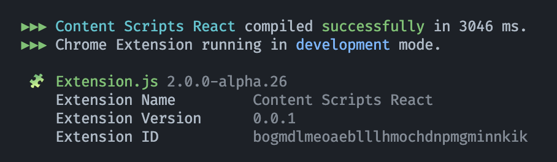

# Announcing Extension.js 2.0.0-alpha

> Steptember 9, 2024

Extension.js is all about making cross-browser extension development as easy as possible.

Since being [featured on HackerNews](https://hnrankings.info/40210627/), we've made a lot of internal improvements to make the package smaller, faster, and more developer-friendly.

To me, "very easy" means very low cognitive effort. It means something is familiar. Developers are familiar with copy/paste, and as a developer myself, it feels very easy if I can copy/paste code and have an instant response of what the code means without configuration. Even if the code is not understandable at first, a fast visual response is a clear indicator of how things are expected to work. That's the expectation of Extension.js v2: something very easy to work with.

**Version 2.0.0-alpha**

* 30+ templates for popular JavaScript frameworks, CSS pre-processors, and extension APIs. [View on GitHub](https://github.com/extension-js/extension.js/tree/main/examples).
* Support for adding browser-specific fields in manifest.json that apply only to the target browser, like `{chrome:service_worker: "sw.js"}`
* `extension.config.js` - For advanced users needing access to the compilation process. [See experimental example](https://github.com/extension-js/extension.js/tree/main/examples/content-extension-config).
* Faster compilation thanks to [SWC](https://swc.rs/).
* A revamped documentation site (this one!).
* A new templates site (coming soon).

The alpha release is focused on bug fixes and testing all existing features while we finish the documentation and templates websites. Keep an eye on this blog or follow us on X for future updates. 

Thanks for reading. Talk soon.

Cezar Augusto 
Creator and Lead Developer, Extension.js