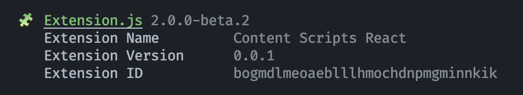

# Announcing Extension.js 2.0.0-beta

> October 18, 2024

Extension.js is now officially in beta.

Beta comes to stabilize the features introduced in the alpha release and to fix all known issues with the browser compatibility. 

**Version 2.0.0-beta**

- Fixed SASS Modules not working in the content script.
- Add support to Svelte templates.
- Add preview command.
- Add universal support for content_scripts (via hard-reload and hot-reload).
- Fix all known browser issues for Firefox, Edge, and Chrome.
- Updated documentation (this one!)

The beta release is focused on making all the existing features stable enough to document and test. New features are locked until the next stable release and the documentation is now up-to-date. This is the last beta release before the release candidate.

For the next release, we are going to focus on shaping Extension.js into a faster and smaller bundle that can work both locally and remotelly (via `pnpm dlx`, `yarn dlx`, and of course `npx`).

Thanks for reading. Talk soon.

Cezar Augusto 
Creator and Lead Developer, Extension.js
