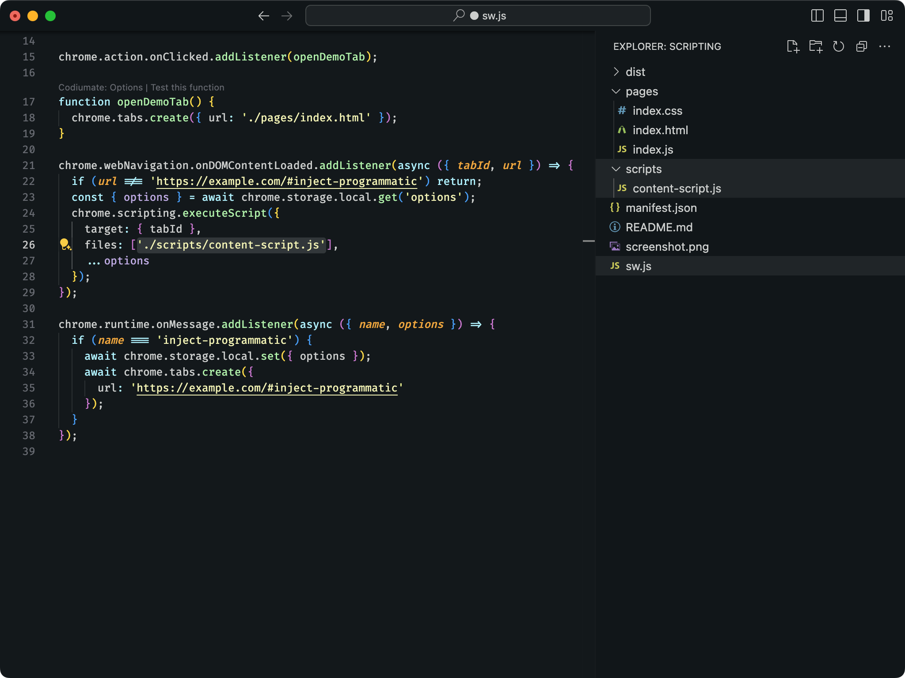

import { AvatarEmoji } from "../../../../theme/components/avatar-emoji";

<AvatarEmoji emoji="folder" />

# Special Folders

Extension.js uses the manifest to generate assets, and by default, files outside its scope are not bundled - unless they are in a special folder.

The need for special folders could be using iframes in sandboxed pages or scripts executed via the `executeScript` API, for example. Since these files can be a requirement to your development process, they need the same support as any other file handled by the manifest, including support for TypeScript, pre-processors, and other features provided by Extension.js.

## How Does It Work?

Each special folder serves a unique purpose:

| Folder Name | **Description**                                                                                                                     |
| ----------- | ----------------------------------------------------------------------------------------------------------------------------------- |
| `pages/`    | Adds complementary HTML pages to the compilation process, treating them the same as any other HTML file referenced in the manifest. |
| `scripts/`  | Allows script files not declared in the manifest or HTML pages to be compiled.                                                      |
| `public/`   | Adds static assets to the output directory without being processed by Extension.js.                                                 |

## Handling HTML Pages

To work with additional HTML files (like internal pages or `<iframe>` elements), place them in the `pages/` folder. This ensures that these files are integrated into the build process like any other HTML file defined in the manifest.

> Important: Every HTML file within the `pages/` folder is treated as a valid entry point and is compiled by Extension.js.

> Consider an iframe used in a sandboxed page. Since this file may be edited frequently during development, adding it inside the `pages/` folder ensures it benefits from hot-reload and pre/post-processors like JavaScript and CSS tools. For an example, see the [Chrome Sandbox Sample](https://github.com/GoogleChrome/chrome-extensions-samples/tree/main/api-samples/sandbox/sandbox)

## Handling Script Files

For JavaScript-like files that don’t require an HTML file, use the `scripts/` folder. Any script file added here is treated as a valid entry point and integrated into the compilation process, just like scripts defined in `manifest.json`.

> Important: Every script file within the `scripts/` folder is compiled by Extension.js.

> If you're using scripts injected via `chrome.scripting.executeScript`, you can place them in the `scripts/` folder. The `scripts/` folder ensures they get hot-reload support and full integration with JavaScript and CSS tools. For an example, see the [Chrome Scripting Sample](https://github.com/GoogleChrome/chrome-extensions-samples/tree/main/api-samples/scripting) where scripts not declared in the manifest are loaded.

## Handling Static Assets

For static assets that you don’t want Extension.js to process or when you need a predictable output path, use the `public/` folder. Files here, such as images or external libraries, are copied to the output directory as-is. You can reference them directly using absolute paths from the root, and they will not be bundled or optimized by Extension.js.

> Important: Every file within the `public/` folder is copied to the output directory without being processed by Extension.js.

> Suppose you’re using `handlebars.js` and don’t want it processed by Extension.js. You can place it in the `public/` folder, and Extension.js will output the file as-is, skipping compilation or bundling steps. For an example, see the [Chrome Sandbox Sample](https://github.com/GoogleChrome/chrome-extensions-samples/tree/main/api-samples/sandbox/sandbox) as well.

## Best Practices

- **Use the `pages/` folder for HTML files**: For internal pages or iframes, place them in the `pages/` folder to benefit from hot-reload and pre/post-processors.
- **Use the `scripts/` folder for script files**: For scripts injected via `chrome.scripting.executeScript`, place them in the `scripts/` folder to benefit from hot-reload and full integration with JavaScript and CSS tools.
- **Use the `public/` folder for static assets**: For static assets that you don't want processed by Extension.js, place them in the `public/` folder to ensure they are copied to the output directory as-is.

## Next Steps

- Check out the different [Templates](../getting-started/templates) to bootstrap your next extension.
