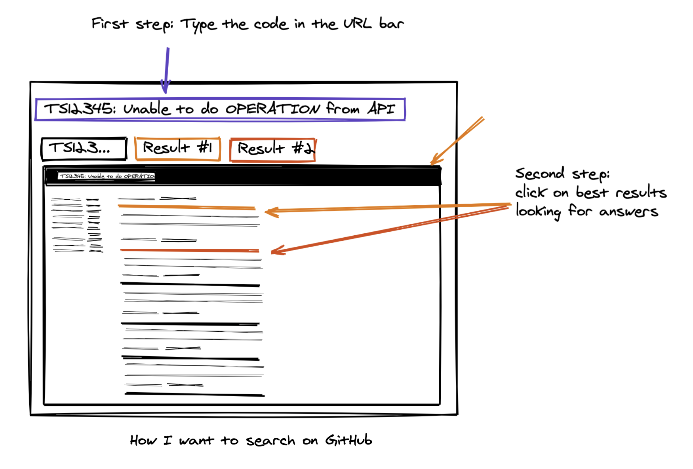
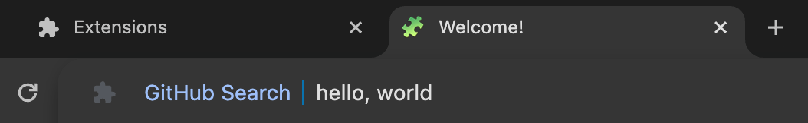
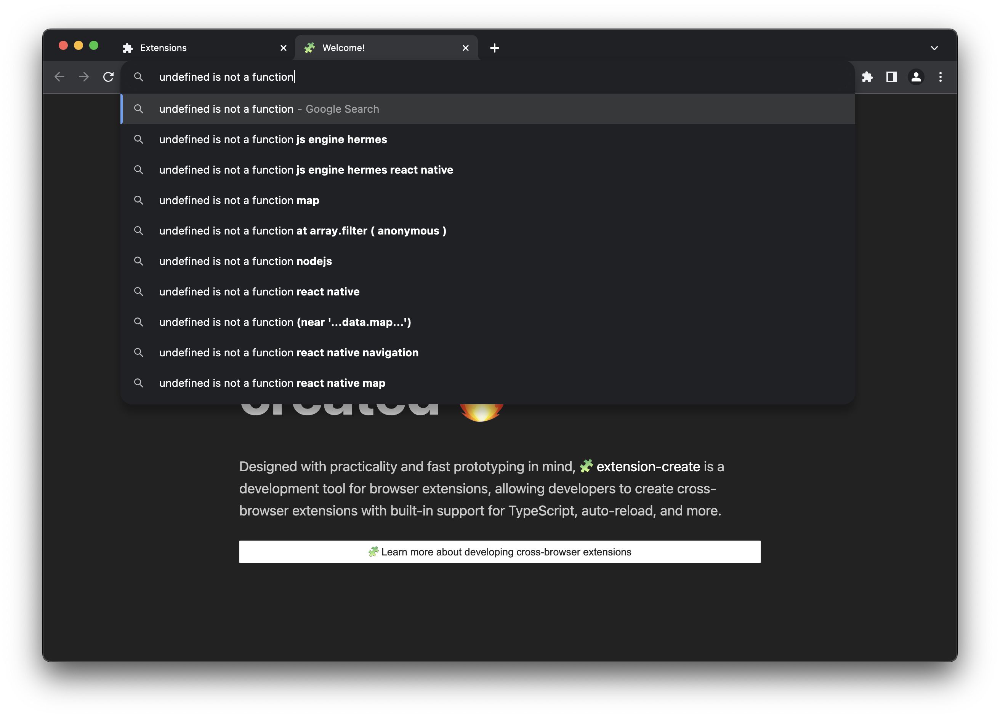

import { PackageManagerTabs } from "@theme";

# Create Your First Extension

Let's learn together how to create an extension from scratch using Extension.js.

Take a common task for some developers: searching on GitHub.

**The problem:** I want to search on GitHub in the most convenient way. Imagine searching GitHub projects directly from your browser's URL bar.

The solution? Meet github_search, a tool that makes this possible.



## The Plan

Our goal is to make searching GitHub projects as easy as searching on Google. To avoid irrelevant searches when the user decides to search for something else, let's reserve a keyword for our extension: if the user types "gh," followed by a tab click, it will activate our extension to trigger the search.



> The interface that we are creating here.

## Step 1 - Create the extension

Let's use the Extension.js `create` command to bootstrap a minimal extension for us. Let's call it: `github-search`

<PackageManagerTabs
  command={{
    npm: "npx extension@latest create github-search --template=init",
    pnpm: "pnpx extension@latest create github-search --template=init",
    yarn: "yarn dlx extension@latest create github-search --template=init",
  }}
/>

## Step 2 - Create the manifest file

<div style={{ position: "relative", paddingBottom: "62.5%", height: 0 }}>
  <iframe
    src="https://www.loom.com/embed/1193dc69f7b74a56a5f5d9e0324c255d?sid=99132929-4c05-40e7-b804-3f242daf95ea"
    allowFullScreen
    style={{
      position: "absolute",
      top: 0,
      left: 0,
      width: "100%",
      height: "100%",
    }}
  ></iframe>
</div>

> Step 2 Demo

Every extension starts with a manifest file. It tells the browser information about the extension's metadata, permissions, and files that the extension needs to run properly. Based on the [plan above](#plan), we want a custom search shortcut "gh" that will link us to GitHub search. We are also adding a service worker script to handle user events logic.

```json
{
  "manifest_version": 3,
  "name": "GitHub Search",
  "version": "1.0",
  "omnibox": { "keyword": "gh" },
  "background": {
    "service_worker": "service_worker.js"
  }
}
```

- `omnibox.keyword`: When the keyword `gh` is set, an event will be fired.
- `background.service_worker`: Will listen to the event that we just fired.

## Step 3 - Create the Background Service Worker

In the context of a browser extension, the background service worker is where the extension can set listeners for various browser events.

In our case, we need to add a script that listens to input events in the omnibox, so once the user types what they want to search, GitHub can return the correct data.

Let's create a `service_worker.js` file for this purpose:

```js
When the user has accepted what is typed into the omnibox.
chrome.omnibox.onInputEntered.addListener((text) => {
  Convert any special character (spaces, &, ?, etc)
  into a valid character for the URL format.
  const encodedSearchText = encodeURIComponent(text);
  const url = `https://github.com/search?q=${encodedSearchText}&type=issues`;

  chrome.tabs.create({ url });
});
```

The script above will open a new tab with GitHub search results whenever you enter something after "gh" in the URL bar.

## Step 4 - Load Your Extension

If you take a look at your `package.json` file now, it looks more or less like this:

```json
{
  "scripts": {
    "dev": "extension@latest dev",
    "start": "extension start",
    "build": "extension@latest build"
  },
  "devDependencies": {
    "extension": "latest"
  }
}
```

These scripts are the main scripts used by Extension.js for development mode. To preview your extension, let's run it for the first time.

<PackageManagerTabs
  command={{
    npm: "npm run dev",
    pnpm: "pnpm run dev",
    yarn: "yarn run dev",
  }}
/>

If all goes well, you should see a screen like the following:

<div style={{ position: "relative", paddingBottom: "62.5%", height: 0 }}>
  <iframe
    src="https://www.loom.com/embed/777544977a32444ba6de4ff23bdaccbc?sid=360eb1b1-af3a-480b-9e71-41a7fb01ca6e"
    allowFullScreen
    style={{
      position: "absolute",
      top: 0,
      left: 0,
      width: "100%",
      height: "100%",
    }}
  ></iframe>
</div>

That's it! You created your first browser extension that searches on GitHub!

## Step 5 - Making It Better

To improve our search results, let's add search suggestions directly in the URL bar by listening to input changes in the omnibox.

Update the `service_worker.js` file to fetch suggestions from GitHub and display them as you type.

```js
service_worker.js

Create a debounce function to avoid excessive
calls to the GitHub API while the user is still
typing the search query.
function debounce(fn, delay) {
  let timeoutID;
  return function (...args) {
    if (timeoutID) clearTimeout(timeoutID);
    timeoutID = setTimeout(() => fn(...args), delay);
  };
}

When the user has changed what is typed into the omnibox.
chrome.omnibox.onInputChanged.addListener(
  debounce(async (text, suggest) => {
    const response = await fetch(
      `https://api.github.com/search/issues?q=${text}`,
    );
    const data = await response.json();
    const suggestions = data.items.map((issue) => ({
      content: issue.html_url,
      description: issue.title,
    }));

    suggest(suggestions);
  }, 250),
);

When the user has accepted what is typed into the omnibox.
chrome.omnibox.onInputEntered.addListener((text) => {
  Convert any special character (spaces, &, ?, etc)
  into a valid character for the URL format.
  const encodedSearchText = encodeURIComponent(text);
  const url = `https://github.com/search?q=${encodedSearchText}&type=issues`;

  chrome.tabs.create({ url });
});
```

Adding this code will let you see live search suggestions from GitHub right in your URL bar, making the search experience even smoother.



You are done!

## Conclusion

Congratulations! You've built a GitHub search extension. Experiment with it, improve it, and make it your own. This is just the beginning of what you can do with browser extensions.

## Next Steps

- Learn how to load remotely hosted extensions in [Remote Extension Execution](./getting-started/run-remote-extensions).
- Create an extension using one of Extension.js [Templates](./getting-started/templates).
