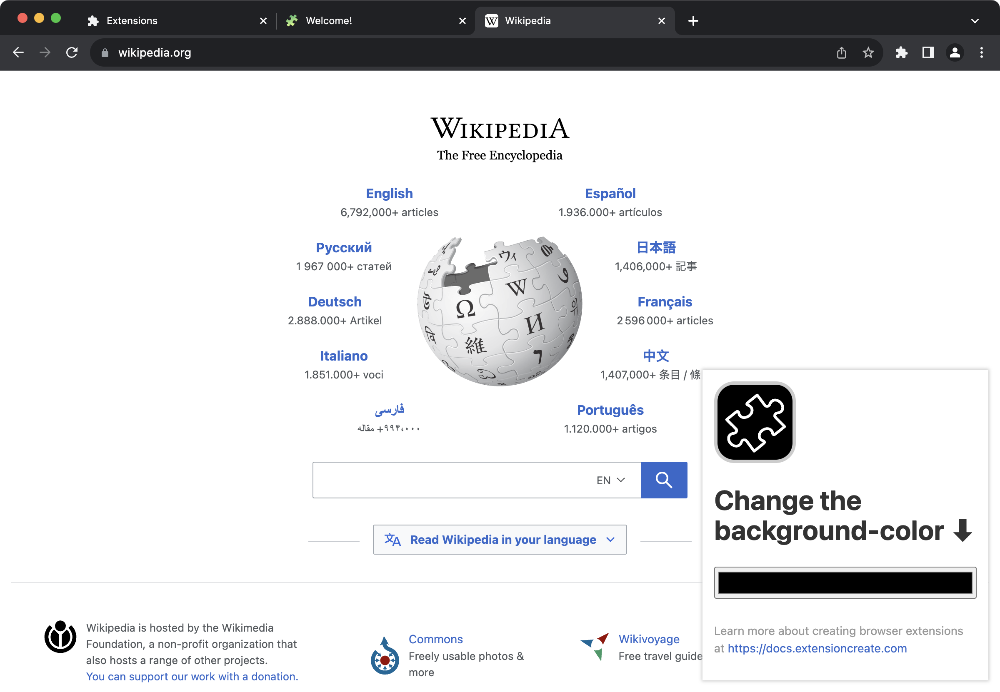
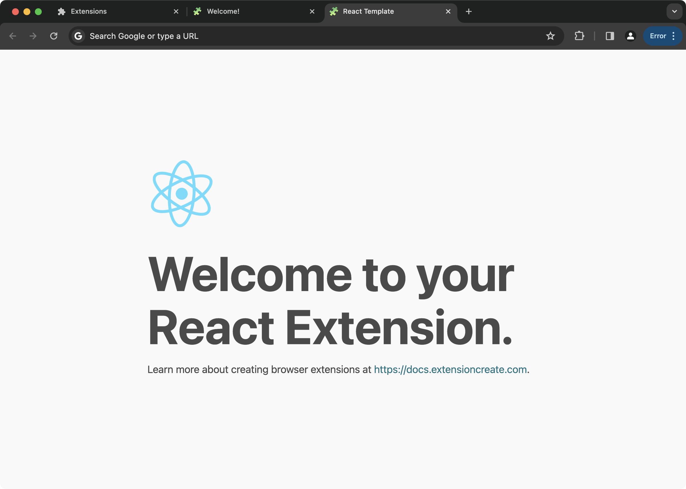

import { PackageManagerTabs } from "@theme";

# Templates

Extension.js allows you to create new browser extensions quickly by using templates. Templates provide pre-built structures, components, and configurations that fit various needs and technologies. By using the `--template` flag, you can select the one that best suits your project requirements.

<PackageManagerTabs
  command={{
    npm: "npx extension@latest create my-extension --template=<template>",
    pnpm: "pnpx extension@latest create my-extension --template=<template>",
    yarn: "yarn dlx extension@latest create my-extension --template=<template>",
  }}
/>

| Template Flag               | Description                                                                                                                                                | Demo                              |
| --------------------------- | ---------------------------------------------------------------------------------------------------------------------------------------------------------- | --------------------------------- |
| `--template=new`            | Includes a new tab page override (default).                                                                                                                | [Demo](#--templatenew)            |
| `--template=init`           | Includes a single manifest.json file.                                                                                                                      | [Demo](#--templateinit)           |
| `--template=content`        | Includes a content_script.                                                                                                                                 | [Demo](#--templatecontent)        |
| `--template=new-react`      | Includes a new tab override using [React](https://react.dev), [TypeScript](https://www.typescriptlang.org/), and [Tailwind.css](https://tailwindcss.com/). | [Demo](#--templatenew-react)      |
| `--template=new-typescript` | Includes a new tab override using [TypeScript](https://www.typescriptlang.org/).                                                                           | [Demo](#--templatenew-typescript) |
| `--template=content-react`  | Includes a content_script using [React](https://react.dev), [TypeScript](https://www.typescriptlang.org/), and [Tailwind.css](https://tailwindcss.com/).   | [Demo](#--templatecontent-react)  |
| `--template=action-chatgpt` | Includes an action using [React](https://react.dev), [Tailwind.css](https://tailwindcss.com/), [DaisyUI](https://daisyui.com), and a ChatGPT integration.  | [Demo](#--templateaction-chatgpt) |

# --template=new

This template is the default for Extension.js, giving you a new tab page override. It’s useful when you want a quick and functional new tab experience using standard web technologies like HTML, CSS, and JavaScript. Ideal for simple, static extensions.

# --template=init

The `init` template is minimal, perfect for fast prototyping or when you just need a basic starting point. It includes only a single `manifest.json` file, allowing you to customize everything else as needed.

<PackageManagerTabs
  command={{
    npm: "npx extension@latest create <your-extension-name> --template=init",
    pnpm: "pnpx extension@latest create <your-extension-name> --template=init",
    yarn: "yarn dlx extension@latest create <your-extension-name> --template=init",
  }}
/>

# --template=content

The `content` template is helpful when your extension needs to interact with existing web content. It includes a content_script that runs in the context of the current tab, allowing you to manipulate the DOM or gather data directly from the page.

<PackageManagerTabs
  command={{
    npm: "npx extension@latest create <your-extension-name> --template=content",
    pnpm: "pnpx extension@latest create <your-extension-name> --template=content",
    yarn: "yarn dlx extension@latest create <your-extension-name> --template=content",
  }}
/>

# --template=new-react

For developers looking to build rich user interfaces, the `new-react` template offers a new tab override using [React](https://react.dev) and [sakura.css](https://oxal.org/projects/sakura/). It’s ideal for developers who prefer JSX and want to quickly scaffold a React-based extension.

<PackageManagerTabs
  command={{
    npm: "npx extension@latest create <your-extension-name> --template=react",
    pnpm: "pnpx extension@latest create <your-extension-name> --template=react",
    yarn: "yarn dlx extension@latest create <your-extension-name> --template=react",
  }}
/>

# --template=new-typescript

This template is great for TypeScript developers who want to include a new tab override built with HTML, CSS, and [TypeScript](https://www.typescriptlang.org/). It provides a strong foundation for building type-safe browser extensions.

<PackageManagerTabs
  command={{
    npm: "npx extension@latest create <your-extension-name> --template=typescript",
    pnpm: "pnpx extension@latest create <your-extension-name> --template=typescript",
    yarn: "yarn dlx extension@latest create <your-extension-name> --template=typescript",
  }}
/>

# --template=content-react

This template is a good starting point for extensions that need to interact with web content while using a rich user interface. It includes a content_script built with [React](https://react.dev), [TypeScript](https://www.typescriptlang.org/), and [Tailwind.css](https://tailwindcss.com/).

<PackageManagerTabs
  command={{
    npm: "npx extension@latest create <your-extension-name> --template=react-typescript",
    pnpm: "pnpx extension@latest create <your-extension-name> --template=react-typescript",
    yarn: "yarn dlx extension@latest create <your-extension-name> --template=react-typescript",
  }}
/>

# --template=action-chatgpt

This is the most advanced template offered, fully integrated with the ChatGPT API. It includes a `sidebar_panel` built with [React](https://react.dev), [Tailwind.css](https://tailwindcss.com/), and the official OpenAI Node API library. Ideal for building AI-powered extensions.

<PackageManagerTabs
  command={{
    npm: "npx extension@latest create <your-extension-name> --template=chatgpt",
    pnpm: "pnpx extension@latest create <your-extension-name> --template=chatgpt",
    yarn: "yarn dlx extension@latest create <your-extension-name> --template=chatgpt",
  }}
/>

# More templates

You can find more templates [here](https://github.com/extension-js/extension.js/tree/main/examples). Use a folder name in the template param like so, `--template=<folder_name>`.

# Next Steps

- Understand [Browser Runners](../guides/development/environment-variables) and how they help you visualize your extension.
- Learn how Extension.js handles [Environment Variables](../guides/development/environment-variables).

---
