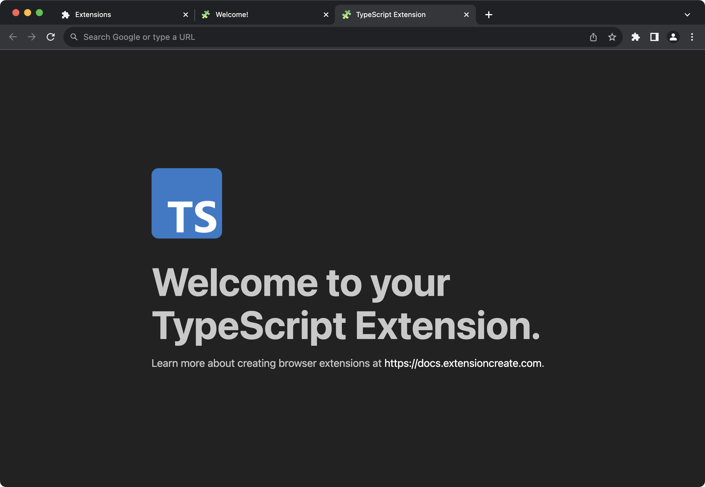

import { PackageManagerTabs } from "@theme";
import { AvatarImage } from "../../../../theme/components/avatar-image";

<AvatarImage icon="typescript" />

# TypeScript

TypeScript adds static types to JavaScript, helping to prevent errors and improve code quality.

Extension.js offers built-in support for TypeScript, making it easy to integrate TypeScript into your browser extension projects.

## Templates for TypeScript Extensions

Extension.js provides two TypeScript templates to get started with:

- **New TypeScript Template**: For creating a new tab page extension using TypeScript.
- **Content TypeScript Template**: For creating a content script-based extension using TypeScript.

### New TypeScript Template

The new TypeScript template is ideal for creating browser extensions that need a new tab page. This template includes everything you need to start building an extension with TypeScript right out of the box.



#### Try it yourself

<PackageManagerTabs
  command={{
    npm: "npx extension@latest create my-extension --template=new-typescript",
    pnpm: "pnpx extension@latest create my-extension --template=new-typescript",
    yarn: "yarn dlx extension@latest create my-extension --template=new-typescript",
  }}
/>

### Content TypeScript Template

The content TypeScript template is designed for extensions that need content scripts. This template enables you to inject TypeScript-based scripts directly into web pages.

#### Try it yourself

<PackageManagerTabs
  command={{
    npm: "npx extension@latest create my-extension --template=content-typescript",
    pnpm: "pnpx extension@latest create my-extension --template=content-typescript",
    yarn: "yarn dlx extension@latest create my-extension --template=content-typescript",
  }}
/>

## Using TypeScript with an Existing Extension

If you want to add TypeScript support to an existing extension, follow these steps.

### Installation

1. Install TypeScript as a development dependency:

<PackageManagerTabs command="install -D typescript" />

2. Initialize the TypeScript config file `tsconfig.json`:

<PackageManagerTabs command="tsc --init" />

### Configuration

#### Automatic TypeScript Support

If your extension includes TypeScript but lacks a `tsconfig.json`, Extension.js will automatically generate one with these default settings:

```json5
{
  compilerOptions: {
    allowJs: true,
    allowSyntheticDefaultImports: true,
    esModuleInterop: true,
    forceConsistentCasingInFileNames: true,
    isolatedModules: true,
    jsx: "react-jsx",
    lib: ["dom", "dom.iterable", "esnext"],
    moduleResolution: "node",
    module: "esnext",
    noEmit: true,
    resolveJsonModule: true,
    strict: true,
    target: "esnext",
    verbatimModuleSyntax: true,
    useDefineForClassFields: true,
    skipLibCheck: true,
  },
  include: ["./"],
  exclude: ["node_modules", "dist"],
}
```

#### Automatic Types

If your extension uses TypeScript, Extension.js will automatically install the necessary types for common libraries like `chrome`, `webextension-polyfill`, and `node` in a `extension-env.d.ts` file, which is auto-generated in the project root directory.

```ts
// Required Extension.js types for TypeScript projects.
// This file is auto-generated and should not be excluded.
// If you need additional types, consider creating a new *.d.ts file and
// referencing it in the "include" array of your tsconfig.json file.
// See https://www.typescriptlang.org/tsconfig#include for more information.
/// <reference types="extension/dist/types/index.d.ts" />

// Polyfill types for browser.* APIs.
/// <reference types="extension/dist/types/polyfill.d.ts" />
```

## Next Steps

- Explore how Extension.js handles [Sass Modules](./sass.mdx).
