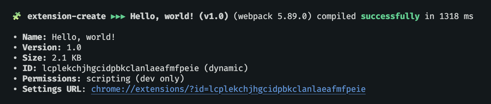

`extension-create` is a development tool for browser extensions, allowing developers to create cross-browser extensions with no build configuration. It has built-in support for [[TypeScript]], [[WebAssembly]], [[React]], and [[modern JavaScript]] (ESNext).

Designed with practicity and fast prototyping in mind, running a single terminal command is enough to start developing your extension and requires no extra knowledge to get started.

## Create a New Extension

<div style="position: relative; padding-bottom: 62.5%; height: 0;"><iframe src="https://www.loom.com/embed/dabe24ad9ef34baa91004b3af48fa0b5?sid=00fcfeec-8b23-4a80-86e7-91b5b7990d4d" frameborder="0" webkitallowfullscreen mozallowfullscreen allowfullscreen style="position: absolute; top: 0; left: 0; width: 100%; height: 100%;"></iframe></div>

`extension-create` has a default `create` command that allows you to generate the foundations of your next extension project (see demo above). It also supports templates via `--template` flag.

```sh
npx extension create <your-extension-name>
```

For a list of all supported templates, see [[Templates]].

## Usage With An Existing Extension

<div style="position: relative; padding-bottom: 62.5%; height: 0;"><iframe src="https://www.loom.com/embed/bff0cf2569dc4abc947f697dc40add9f?sid=42047d01-0925-4098-87ea-59cf8ac34207" frameborder="0" webkitallowfullscreen mozallowfullscreen allowfullscreen style="position: absolute; top: 0; left: 0; width: 100%; height: 100%;"></iframe></div>

If you have an existing extension which is using a package manager, you can install the `extension-create` package and manually create the scripts used to run your extension. See the demo above or follow these instructions to get it done:

**Step 1 - Install extension-create as a `devDependency`**

```sh
npm install extension --save-dev
```

**Step 2 - Link your npm scripts with the executable `extension-create` commands**

```json
{
  "scripts": {
    "dev": "extension dev",
    "start": "extension start",
    "build": "extension build"
  },
  "devDependencies": {
    // ...other deps,
    "extension": "latest"
  }
}
```

Done. You are all set!

- To develop the extension, run `npm run dev`.
- To visualize the extension in production mode, run `npm run start`.
- To build the extension in production mode, run `npm run build`.

## Next Steps

- Learn how to [[Create Your First Extension]].
- Have an idea in mind? Check the built-in [[Templates]] available.

---

**🧩 extension-create** • create cross-browser extensions with no build configuration.
